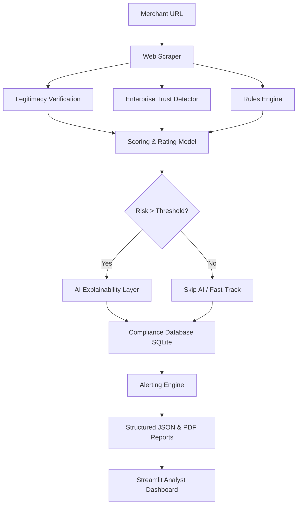

# 🔍 Merchant Risk Intelligence Engine (MRIE)

An enterprise-grade, modular compliance and fraud detection suite designed to automate merchant onboarding screening, risk rating analysis, and transaction-compliance monitoring.

The system combines dynamic web scraping, heuristics-based rules, corporate-footprint verification, and zero-hallucination generative AI to analyze, rate, and explain merchant risk profiles in an audit-ready format.

---

## 🏛️ System Architecture & Workflow

The platform follows a structured **"Rules Detect, Scorer Decides, AI Explains"** operational paradigm:



1. **Intelligent Web Scraping (`src/scraper.py`)**: Uses Playwright and BeautifulSoup to extract merchant information, checkout configurations, payment processors, social links, contact forms, and textual data.
2. **Business Footprint Verification (`src/verifier.py`)**: Checks WHOIS age, domain registration metrics, SSL certificate status, and location parameters to verify corporate legitimacy.
3. **Enterprise Trust Fast-Tracking (`src/trusted_merchant_detector.py`)**: Flags and white-lists recognized enterprise merchants (e.g., global platforms, verified public services) to minimize compliance processing overhead.
4. **Compliance Rules Engine (`src/rules.py`)**: Evaluates the merchant against structured compliance parameters (e.g., missing refund/privacy policies, card schemes logos without integration, chargeback signals, deceptive pricing models). Configured via `config/rules_config.yaml`.
5. **Weighted Scorer (`src/scorer.py`)**: Translates rule flags into a weighted mathematical score (0-100) and maps them to risk bands: `LOW`, `MEDIUM`, `HIGH`, or `CRITICAL`.
6. **Zero-Hallucination AI Explainer (`src/ai_analyzer.py`)**: Utilizes Generative AI to summarize the risk rating, list specific threat indicators, and draft corporate-onboarding analyst briefs.
7. **Compliance Alerting (`src/alert_engine.py`)**: Dispatches priority compliance alerts to target queues based on threat severity.
8. **Structured Reporting (`src/report_generator.py`)**: Compiles A4 compliance PDF packages and programmatic JSON schemas for system audits.
9. **Analyst Command Center (`app.py`)**: An elegant, high-fidelity Streamlit interface for live domain screening, findings visualizers, historical logs, and direct report downloads.

---

## 📂 Codebase Directory Structure

```text
├── config/
│   └── rules_config.yaml         # Configuration file for active risk weights & keywords
├── reports/                      # Output directory for structured PDF & JSON brief packages
├── src/
│   ├── ai_analyzer.py            # Onboarding explanation & AI summary compiler
│   ├── alert_engine.py           # Onboarding alerts dispatcher
│   ├── database.py               # SQLite database schemas and persistence APIs
│   ├── detector.py               # Threat detection heuristics and regex checks
│   ├── pipeline.py               # Production orchestrator (CLI live scan support)
│   ├── report_generator.py       # PDF/JSON programmatic generator
│   ├── rules.py                  # Structured compliance heuristics rulesets
│   ├── scorer.py                 # Weighted risk rating models & algorithms
│   ├── scraper.py                # Playwright & BS4 robust crawling module
│   ├── signals_registry.py       # Global threat & confidence weights mappings
│   ├── test_cases.py             # Sandbox dataset for regression tests
│   ├── trusted_merchant_detector.py # Enterprise brand trust validator
│   └── verifier.py               # Domain registration & WHOIS validity check
├── app.py                        # Elegant Streamlit Analyst Command Dashboard
├── main.py                       # CLI execution entry point
├── requirements.txt              # Project package dependencies
└── README.md                     # Project documentation (You are here!)
```

---

## ⚡ Setup & Installation

### 1. Prerequisites
- **Python 3.10+**
- **Git**
- **pip**

### 2. Clone the Repository & Install Dependencies
```bash
git clone https://github.com/your-username/Merchant-Risk-Engine.git
cd Merchant-Risk-Engine

# Install Python packages
pip install -r requirements.txt

# Install Playwright browser dependencies (for web scraping)
playwright install
```

---

## 🚀 Execution & Usage


```

### 🧪 : Execute Test Cases
Run the pipeline regression suite on default test merchants to verify scoring accuracy and system stability:
```bash
python src/pipeline.py
```

---

## 🛡️ Core Compliance Metrics Evaluated

The engine analyzes 35+ threat indicators grouped into five core pillars:
- **Trust Integrity**: Verify WHOIS lifespan, registrar safety, geographic location mismatches, and domain reputation.
- **Onboarding Risk**: Detect transaction risks, card scheme logo misrepresentations, high-chargeback indicators, and crypto-cashout mechanisms.
- **Merchant Compliance**: Verify physical address disclosures, active telephone indicators, refund policies, and privacy terms disclosures.
- **Business Authenticity**: Identify lack of operational content, generic single-page layouts, and standard domain registry indicators.
- **Marketing Compliance**: Flags deceptive copywriting, misleading claims, and aggressive pricing practices.
